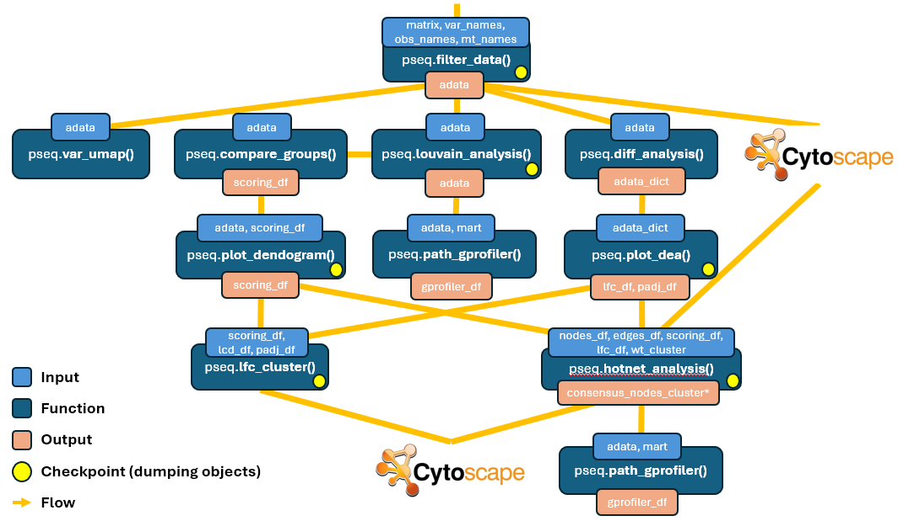

This project introduces a comprehensive pipeline that compares and integrates various bioinformatics tools and methodologies derived from extensive bibliographic research that leverages high-throughput results from Perturb-seq experiments to perform differential gene expression and retrieve complex altered PPi subnetworks from STRING database using an implementation of the Hierarchical HotNet algorithm (fig. 1). The pipeline demonstrates excellent performance, successfully distinguishes impactful variants, identifies variants with similar expression profiles, and shows promising results for retrieving key affected modules already observed in KRAS and TP53 variants. These promising results indicate the potential of the Perturb-seq approach to become a standard strategy for uncovering not only common significantly expressed genes, but also interactors that could be targeted in future therapeutic strategies.  

*Check the [analysis pipeline image](#Analysis-pipeline) and the [updates section](#Updates) for the current development status.  


# Installation
Make sure that `perturbseq_analysis.py` and `hotnet` folder are in the same directory as the Jupyter Notebook you shall create to execute the functions. Executable only in Linux.  


# Functions
```
import perturbseq_analysis as pseq
```
- [Filtering data](#Filtering-data)
- [Hierarchies analysis](#Hierarchies-analysis)
  - [Comparing variants expression profiles](#Comparing-variants-expression-profiles)
  - [Hierarchical dendogram and clustering](#Hierarchical-dendogram-and-clustering)
- [Leiden analysis](#Leiden-analysis)
  - [Leiden clustering](#Leiden-clustering)
  - [UMAP by variants](#UMAP-by-variants)
- [Differential expression analysis (DEA)](#Differential-expression-analysis-DEA)
  - [Running DEA](#Running-DEA)
  - [Plotting DEA results](#Plotting-DEA-results)
- [Network analysis](#Network-analysis)
  - [Finding significantly altered subnetworks per cluster](#Finding-significantly-altered-subnetworks-per-cluster)
  - [Processing significantly altered subnetworks per cluster](#Processing-significantly-altered-subnetworks-per-cluster)
- [Pathway enrichment analysis](#Pathway-enrichment-analysis)

## Filtering data:
· Plotting some raw statistics (so the user can decide some filters).  
· Downsampling cells with >(`input user 2`) counts to <=(`ìnput user 2`) counts.  
· Batch effect correction by a downsampling factor (`input user 3`).  
· Removing cells with <(`input user 1`) counts, cells with >20% mitochondrial counts, cells with <200 genes.  
· Removing genes present in <5% cells, and lowest variable (0.0125 as minimum mean expression, 4 as maximum mean expression, and 0.4 as the minimum dispersion levels).  
. Plotting the fraction of counts assigned to each 20% most highly variable gene over all cells (also saved in `./results/filter_data_variable_genes.png`), and the total counts of cells VS the number of genes whose points are colored by the percentage of mitochondrial counts (also saved in `./results/filter_data_counts.png`).  
· Normalizing, log-transforming, calculating to z-scores, and running Principal Component Analysis (PCs ranking is plotted and saved in `./results/filter_data_pca.png`).
```
adata, adata_nor = pseq.filter_data(matrix, var_names, obs_names, mt_names, batch_nums)

# matrix is a dataframe with raw counts whose head and index are genes and cells, respectively,
# var_names is a list containing the genes (HGNC nomenclature) assigned to each column,
# obs_names is a list containing the variants assigned to each cell (row),
# mt_names is a list containing the mitochondrial genes names,
# and batch_nums is a list containing the batches that each cell belongs to
```
It returns two AnnData objects filtered, but the second is also normalized and data-transformated (CHECKPOINT: both saved in `./results/filter_data.pkl` and `./results/normalized_data.pkl`).  

## Hierarchies analysis:
### Comparing variants expression profiles:
Calculating Hotelling’s T2 statistic, Pearson score, Spearman value, and L1 linkage between each variant and reference group, deriving an empirical null distribution of those scores, and then calculating and plotting the threshold for each method as 5% of desired FDR. plots are saved in `./results/`.
```
scoring_df = pseqcompare_groups(adata_nor, reference)

# adata_nor is the normalized AnnData object obtained from filter_data function,
# reference is a string with the name of the reference group
```
It returns a dataframes of metric scores calculated for each variant VS reference group.  

### Hierarchical dendogram and clustering:
Hierarchical dendogram based on Spearman correlation, hierarchical clustering based on visual inspection changing the threshold parameter, and plotting the heat map.
```
scoring_df = pseq.plot_dendogram(adata_nor, reference, scoring_df, h2_thresh, color_thresh)

# adata_nor is the normalized AnnData object obtained from filter_data function,
# reference is a string with the name of the reference group,
# scoring_df is the dataframe obtained from compare_groups() function,
# h2_thresh is the HotellingT2 threshold obtained in compute_fdr() function,
# color_thresh is a float number to change as desired the number of clusters in the dendogram.
```
It returns the same dataframe now containing the `cluster` column indicating the group in which the variant is placed.  

## Leiden analysis:
### Leiden clustering:
It displays two UMAP plots (leiden clusters of cells, and leiden clusters of genes), and a dataframe with the variant presence (%) in each leiden group (all saved in `./results/`).
```
adata_nor = pseq.leiden_clustering(adata_nor, n_pcs, resolution)

# adata_nor is the normalized AnnData object obtained from filter_data() function
# n_pcs is the integer number of Principal Components to use for clustering
# resolution is a float number to change as desired the number of resulting clusters
```
It returns an AnnData object obtained from leiden clustering (CHECKPOINT: also saved in `./results/normalized_data.pkl`).  

### UMAP by variants:
Plot UMAP of each variant against the Wild Type (WT) (all also saved in `./results/var_umap/`).
```
pseq.var_umap(adata)

# adata is the AnnData object obtained from any of the previous functions
```   

## Differential expression analysis (DEA):
### Running DEA:
DEA with the library PyDESeq2, a Python implementation of the DESeq2 method in R.
```
result_dict = pseq.diff_analysis(adata)

# adata is the non-normalized AnnData object obtained from the filter_data() function
```
It returns a dict: keys are variants and values are DEA results with regards to WT. Use `result_dict[*variant*].results_df` to display results.  

### Plotting DEA results:
```
lfc_df, padj_df = pseq.plot_dea(result_dict)

# result_dict is the dict obtained from the diff_analysis() function
```
It returns two dataframes  (CHECKPOINT: both also saved in `./results/diff_analysis/`) containing LFC and corrected p-values info, respectively. All plots are saved in `./results/diff_analysis/`.  

## Network analysis:
### Finding significantly altered subnetworks per cluster:
Modified implementation of Hierarchical HotNet algorithm (https://doi.org/10.1093/bioinformatics/bty613): it integrates nodes and edges data from the STRING network constructed in Cytoscape using the most variable genes (those not filtered), and LFC values and q-values from DEA as scores, to create two groups (one per type of score) of significantly altered consensus subnetworks per cluster of variants.
```
pseq.hotnet_analysis(nodes_df, edges_df, lfc_df, padj_df, scoring_df, wt_cluster)

# nodes_df and edges_df are dataframes containing info about the nodes and edges, respectively, of the constructed network in Cytoscape using STRING
# lfc_df and padj_df are the dataframes obtained from plot_dea() function
# scoring_df is the dataframe obtained from plot_dendogram() function
# wt_cluster is the integer number referring to the Wild type cluster
```
It generates one `.txt` file per cluster saved in `./results/hotnet_output/results/` to feed Cytoscape for further functional enrichment.  

### Processing significantly altered subnetworks per cluster:
Performing consensus (intersection) of the two groups (one per type of score) significantly altered consensus subnetworks per cluster of variants obtained from `hotnet_analysis()` function, retrieving the mean LFC values from significant genes appearing in a certain number variants of the same cluster and their Coefficient of Variation (CV) if > 30%, and generating a file with the interactor connecting the disconnected subnetworks. CSV files are saved in `./results/hotnet_output/results/`.
```
pseq.clusnet_analysis(nodes_raw, edges_raw, lfc_df, padj_df, scoring_df, wt_cluster, thresh, perb_gene)

# Parameters are the same as hotnet_analysis function, except:
# thresh is the fraction (float 0-1) of variants of same cluster a gene must be significant in
# perb_gene is a string with the name of the perturbed gene
```  

## Pathway enrichment analysis:
GO and KEGG annotations using the gprofiler library.  
```
gprofiler_df = pseq.path_gprofiler(genes_dict, verbosity=1)

# genes_dict is a dict whose keys are the cluster numbers, and values are list of genes
# verbosity is a number that if different of 0 additional detail are displayed on screen
```
It returns a dataframe with GO and KEGG annotations of each cluster (also saved in `./results/`).  


# Analysis pipeline:
  


# Updates:
· Function `filter_data()`: removing genes present in <5% cells instead of <3 cells.  
· Function `plot_dendogram()`: calculating Spearman correlation instead of Pearson correlation.  
· Function `leiden_clustering()`: implementing Leiden algorithm instead of Louvain algorithm (function `louvain_clustering()` deprecated).  


# Example:
Find in the `example*` folders of this repository the Jupyter Notebook `perturbseq_example.ipynb`. It executes all functions of `perturbseq_analysis.py` with data recovered from the study 'Massively parallel phenotyping of coding variants in cancer with Perturb-seq' (https://doi.org/10.1038/s41587-021-01160-7). All expected outputs are saved in `example*/results/` folder, except AnnData objects from checkpoints (too big). 


# Requirements
List of packages versions used:
```
- python 3.12.2
- numpy 1.26.4
- pandas 2.2.2
- scanpy 1.10.1
- seaborn 0.13.2
- pickle 3.12.3
- matplotlib 3.8.4
- gprofiler 1.2.2
- scipy 1.12.0
- goatools 1.4.4
- pydeseq2 0.4.9
- networkx 3.3
- h5py 3.11.0
```  
