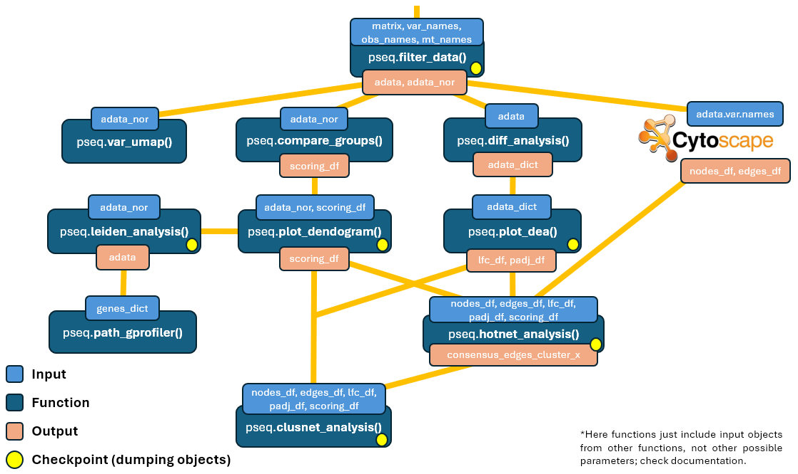

Single-cell RNA sequencing (scRNA-seq) data from perturb-seq experiments aims to investigate the functional impact of genetic variants in cancer. However, the phenotypic impact is complex and may not result in distinct clusters. Instead, the functional impact may manifest as a spectrum of gene expression changes. Therefore, closer relationships between interconnected genes in molecular networks must be prioritized.  

Using network diffusion algorithms, such as the Diffuse tool in Cytoscape, it is possible to propagate biological signals or information across gene interaction networks derived from the perturb-seq data. By analysing the diffusion scores or signal propagation patterns, the goal is to identify pairs of genes that exhibit closer relationships or functional associations, providing insights into gene function, regulatory mechanisms, and disease pathways.  

This analysis pipeline also contains a Python implementation (`perturbseq_analysis.py`) to incorporate additional features such as data filtering, clustering, and pathway annotation with a Python implementation for analysing raw counts matrices obtained from any perturb-seq experiment.  

*Check the analysis pipeline image below to know the development status of this project.  


# Functions
```
import perturbseq_analysis as pseq
```
- [Filtering data](#Filtering-data)
- [UMAP by variants](#UMAP-by-variants)
- [Louvain clustering](#Louvain-clustering)
  - [Clustering by cells](#Clustering-by-cells)
  - [Clustering by genes](#Clustering-by-genes)
- [Pathway enrichment analysis](#Pathway-enrichment-analysis)
  - [Using the gprofiler library](#Using-the-gprofiler-library)
  - [Using the goatools library](#Using-the-goatools-library)
- [Differential expression analysis (DEA)](#Differential-expression-analysis-DEA)
  - [Plotting DEA results](#Plotting-DEA-results)
- [Comparing variants expression profiles](#Comparing-variants-expression-profiles)
  - [Calculating threshold for 5% of FDR](#Calculating-threshold-for-5-of-FDR)
  - [Hierarchical dendogram and clustering](#Hierarchical-dendogram-and-clustering)
- [Merging LFC info per cluster](#Merging-LFC-info-per-cluster)

## Filtering data:
· Plotting some raw statistics (so the user can decide some filters) and later the 20% most highly variable genes (also saved in `./results/`).  
· Removing cells with <(`input user 1`) counts, cells with >20% mitochondrial counts, cells with <200 genes, genes present in <3 cells, and 80% lowest variable genes.  
· Downsampling cells with >(`input user 2`) counts to <=(`ìnput user 2`) counts.  
· Batch effect correction by a downsampling factor (`input user 3`).
```
adata = pseq.filter_data(matrix, var_names, obs_names, mt_names, batch_nums):
# matrix is a dataframe with raw counts whose head and index are genes and cells, respectively,
# var_names is a list containing the genes (HGNC nomenclature) assigned to each column,
# obs_names is a list containing the variants assigned to each cell (row),
# mt_names is a list containing the mitochondrial genes names,
# and batch_nums is a list containing the batches that each cell belongs to
```
It returns an AnnData object with data filtered (CHECKPOINT: also saved in `./results/filter_data.pkl`).  

## UMAP by variants:
Plot UMAP of each variant against the wild type (WT) (all also saved in `./results/var_umap/`).
```
pseq.var_umap(adata)
# adata is the AnnData object obtained from any of the previous functions
```

## Louvain clustering:
### Clustering by cells:
It displays a UMAP plot with louvain clusters, and dataframe with the variant presence (%) in each louvain group (also both saved in `./results/`).
```
adata = pseq.louvain_cells(adata)
# adata is the AnnData object obtained from filter_data() or louvain_genes() functions
```
It returns an AnnData object obtained from louvain clustering.  

### Clustering by genes:
It displays a UMAP plot with louvain clusters (also saved in `./results/`).
```
adata = pseq.louvain_genes(adata)
# adata is the AnnData object obtained from filter_data() or louvain_cells() functions
```
It returns an AnnData object obtained from louvain clustering (CHECKPOINT: also saved in `./results/louvain_data.pkl`).  

## Pathway enrichment analysis:
### Using the gprofiler library:
```
gprofiler_df = pseq.path_gprofiler(adata, mart):
# adata is the AnnData object obtained from louvain_genes() function,
# and mart is a txt obtained from ensembl mapping (retrieve the genes ID with BioMart)
```
It returns a dataframe with pathways annotations of each louvain cluster (also saved in `./results/`).  

### Using the goatools library:
```
goatools_df = pseq.path_goatools(adata, entrez):
# adata is the AnnData object obtained from louvain_genes function,
# and entrez is a txt obtained from NCBI mapping (https://pubchem.ncbi.nlm.nih.gov/upload/tools/)
```
It return dataframe with pathways annotations of each louvain cluster (also saved in `./results/`).  

## Differential expression analysis (DEA):
DEA with the library PyDESeq2, a Python implementation of the DESeq2 method in R.
```
result_dict = pseq.diff_analysis(adata):
# adata is the AnnData object obtained from any of the previous functions
```
It returns a dict: keys are variants and values are DEA results with regards to WT. Use returned_dict[variant].results_df to display results.  

### Plotting DEA results:
```
lfc_df, padj_df = pseq.plot_dea(result_dict):
# result_dict is the dict obtained from the diff_analysis() function
```
It returns two dataframes  (CHECKPOINT: both also saved in `./results/diff_analysis/`) containing LFC and corrected p-values info, respectively. All plots are saved in `./results/diff_analysis/`.  

## Comparing variants expression profiles:
Calculating Hotelling’s T2 statistic, Pearson score, Spearman value, and L1 linkage between each variant and reference group, and deriving an empirical null distribution of those scores.
```
adata, result_df, permuted_df = pseq.compare_groups(adata, reference)
# adata is the AnnData object obtained from any of the previous functions
```
It returns an AnnData object with z-scores, and the rest are both dataframes of metric scores calculated for each variant VS reference group, and as null distribution.  

### Calculating threshold for 5% of FDR:
```
result_df = pseq.compute_fdr(result_df, permuted_df)
# both arguments are dataframes obtained from compare_groups() function
```
It returns the same dataframe with new columns about FDR. All plots are saved in `./results/`.

### Hierarchical dendogram and clustering:
Based on Pearson scores and visual inspection (changing the threshold), respectively.
```
result_df = pseq.plot_dendogram(result_df, threshold)
# result_df is the dataframe obtained from compare_groups() or compute_fdr() function, and threshold is a float number.
```
It returns the same dataframe with a new column indicating the cluster each variant belongs to.  

## Merging LFC info per cluster:
Creating CSV for Cytoscape with LFC info from significant genes appearing in all variants of the same cluster.
```
pseq.flc_cluster(lfc_df, padj_df, scoring_df)
# result_df is the dataframe obtained from plot_dendogram() function
```   

# Analysis pipeline:
  


# Updates:
· New functions: compare_groups(), compute_fdr(), and flc_cluster()  


# Example:

Find in the folder `example*` of this repository the Jupyter Notebook `perturbseq_example.ipynb`.
Find in the examples folders of this repository the Jupyter Notebook `perturbseq_example.ipynb`.
It executes all functions of `perturbseq_analysis.py` with data recovered from the study
'Massively parallel phenotyping of coding variants in cancer with Perturb-seq' (https://doi.org/10.1038/s41587-021-01160-7).
All expected outputs are saved in `example*/results/` folder, except AnnData objects from checkpoints (too big).
All expected outputs are saved in `./results/` folder, except AnnData objects from checkpoints (∼3GB).  


# Requirements
List of packages versions used:
```
- python 3.12.2
- numpy 1.26.4
- pandas 2.2.2
- scanpy 1.10.1
- seaborn 0.13.2
- pickle 3.12.3
- matplotlib 3.8.4
- gprofiler 1.2.2
- scipy 1.12.0
- goatools 1.4.4
- pydeseq2 0.4.9
```
